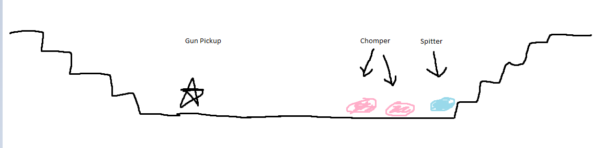

[](https://classroom.github.com/a/YyUO0xtt)
# COMP2150  - Level Design Document
### Name: Terrence Gunawan
### Student number: 47874333

This document discusses and reflects on the design of your platformer level for the Level Design assessment. It should be 1500 words. Make sure you delete this and all other instructional text throughout the document before checking your word count prior to submission. Hint: You can check word count by copying this text into a Word or Google doc.

Your document must include images. To insert an image into your documentation, place it in the "DocImages" folder in this repo, then place the below text where you want the image to appear:

```

```

Example:


## 1. Player Experience (~700 words)
Outline and justify how your level design facilitates the core player experience goals outlined in the assignment spec. Each section should be supported by specific examples and screenshots of your game encounters that highlight design choices made to facilitate that particular experience.

### 1.1. Discovery
What does the player learn? How does your encounter and broader level design facilitate learning in a way that follows good design practice?

The player is intended to learn the mechanics and dyanmics of the game. For example when the player gets the staff some breakable blocks are faced to the player to give a use of the staff. The player learns to use the staff as it is the only other thing on the screen making is instinctive to use. Another scenario is the moving platform at the beginning and fall through platforms. To progress they would have to pass through each obstacle and they are the only encounter on screen. All these singular encounters can reinforce learning as you have to perform it mutiple times making the goal of the game clear making the player know what they are working towards

### 1.2. Drama
What is the intensity curve? How does your design facilitate increasing yet modulating intensity, with moments of tension and relief? 
The intensity curve starts low, which slowly gets higher which peaks at manuvering around the moving platforms above the acid. After that it gives a breather, which the player can take 2 different paths, one focusing more on killing enemies and the other movemennt with varying intensity. After completing either of those sections there is a another breather following a harder variation with mutitple moving platforms creating the peak intensity of the game. Another breather after that and starting the last section entering a maze with enemies and obstacles to navigate through slowly lowering the intensity. This constant state of risk then reward traps the player in the flow state allowing them to enjoy the game. 
### 1.3. Challenge
What are the main challenges? How have you designed and balanced these challenges to control the difficulty curve and keep the player in the flow channel?
The main challenges in this game is the movement to avoid falling into the acid reseting your progress. Enemies are added in to restrict the player movement and pose as another threat to the player. I designed it in a way where if i played that part of the section and it felt boring i would do something to add difficulty to retain flow. My level poses a few challenges in the early game being able to kill an enemy before they can interact with you, but as you progress,  enemies start appearing in places you want to be but also aren't easy to kill. The diffuculty curve follows the intensity curve as you progress in the game the challenges get harder giving the feeling to the player of natural progression. In section 3 there is a puzzle where you have to push an interactable block to boost yourself to find the keydoor. Although this isn't difficult it adds depth and complexity as are enemies and spikes are added to make it harder for the player to navigate through the maze.
### 1.4. Exploration
How does your level design facilitate autonomy and invite the player to explore? How do your aesthetic and layout choices create distinct and memorable spaces and/or places?
In the section 2 of my level i have incoporated a platform moving up to explore a different path which faces more enemies rather manvuering. Also using different blocks creating a unique experience that different to the other section. 
In section 3 of my level i have created a maze-like structure inviting the player to find the key and the key door. With so many directions to go, the player has the facility to choose their own path, with hidden secrets(the key and keydoor). Adding a pushable block to complete the level that the player has to discover and find what to do with it invites the player to explore. I added enviornmental clues such as spikes to indicate the wrong path/direction.

## 2. Core Gameplay (~400 words)
A section on Core Gameplay, where storyboards are used to outline how you introduce the player to each of the required gameplay elements in the first section of the game. Storyboards should follow the format provided in lectures.

Storyboards can be combined when multiple mechanics are introduced within a single encounter. Each section should include a sentence or two to briefly justify why you chose to introduce the mechanic/s to the player in that sequence.

You should restructure the headings below to match the order they appear in your level.

### 2.6. Moving Platforms
As my level first focuses on movement, it was only natural to have moving platforms go in tandemn with learning to move. Doing it in a safe environment allows the player to not feel bad for failiure.

### 2.11. Weapon Pickup (Staff)
I choose the staff to go next rather than the gun because the staff can break breakables as well as monsters so i thought it would be better to encounter it first.
### 2.7. Passthrough Platforms
This wasn't always here. From my first design (DocImages/secondpart.png). I forgot to incorporate passthrough platforms so i decieded to add them after the breakables giving more layer to the game.
### 2.10. Weapon Pickup (Gun)
The gun was the last mechanic that the player learns because its only use is to kill enemies. I designed it in a way to safely kill the Chompers and Spitters safely.
### 2.3. Chompers
The first enemy introduced as it being the easiest to handle having a gun and staff. Only natural making it the first enemy.
### 2.9. Spitters
As the only other enemy i made it right after the Chomper to introduce the enemy types to the player.
### 2.2. Checkpoints
A checkpoint is introduced at the end of the first section.The ability to die is very low in the first section so i added the checkpoint after it where you can actually die.
### 2.8. Spikes
Spikes are introduced after the enemies because i place them as a lower level threat so the player doesn't need to have its own section for practice.
### 2.1. Acid
Acid is introduced with moving platforms increasing the difficulty as falling in it puts you back to the last checkpoint. The checkpoint isn't that far and isn't hard to get back where you got up too if you killed the enemies before it. 
### 2.5. Keys
A key is introduced above a one block with a spitter on it. The player has to kill the spitter to jump on the block to get to the key safely. 
### 2.4. Health Pickups
A health pickup is introduced after the acid giving the player a breathing room if the player made a few mistakes before hand.


## 3. Spatiotemporal Design
A section on Spatiotemporal Design, which includes your molecule diagram and annotated level maps (one for each main section of your level). These diagrams may be made digitally or by hand, but must not be created from screenshots of your game. The annotated level maps should show the structure you intend to build, included game elements, and the path the player is expected to take through the level. Examples of these diagrams are included in the level design lectures.

No additional words are necessary for this section (any words should only be within your images/diagrams).
 
### 3.1. Molecule Diagram


### 3.2. Level Map – Section 1

### 3.3.	Level Map – Section 2

### 3.4.	Level Map – Section 3

## 4. Iterative Design (~400 words)
Reflect on how iterative design helped to improve your level. Additional prototypes and design artefacts should be included to demonstrate that you followed an iterative design process (e.g. pictures of paper prototypes, early grey-boxed maps, additional storyboards of later gameplay sequences, etc.). You can also use this section to justify design changes made in Unity after you drew your level design maps shown in section 3. 

These images were early drafts of what my level would start to look like. This was the interative design for section 1. 

I wanted this to 




You should conclude by highlighting a specific example of an encounter, or another aspect of your level design, that could be improved through further iterative design.

## Generative AI Use Acknowledgement

Use the below table to indicate any Generative AI or writing assistance tools used in creating your document. Please be honest and thorough in your reporting, as this will allow us to give you the marks you have earnt. Place any drafts or other evidence inside this repository. This form and related evidence do not count to your word count.
An example has been included. Please replace this with any actual tools, and add more as necessary.


### Tool Used: ChatGPT
**Nature of Use** Finding relevant design theory.

**Evidence Attached?** Screenshot of ChatGPT conversation included in the folder "GenAI" in this repo.

**Additional Notes:** I used ChatGPT to try and find some more relevant design theory that I could apply to my game. After googling them, however, I found most of them were inaccurate, and some didn't exist. One theory mentioned, however, was useful, and I've incorporated it into my work.

### Tool Used: Example
**Nature of Use** Example Text

**Evidence Attached?** Example Text

**Additional Notes:** Example Text


